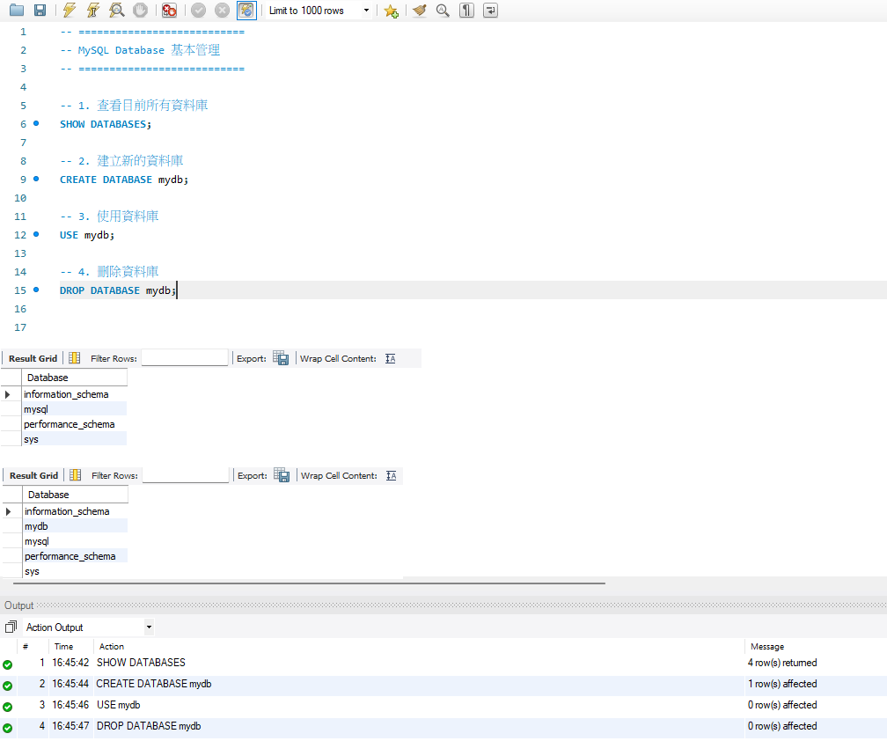

 SQL 指令
=
  
 查看資料庫: 查看現有的資料庫  
 SHOW DATABASES;  

---
 
 建立資料庫: 建立新的資料庫  
 CREATE DATABASE 資料庫名稱;  
 
 刪除資料庫: 刪除現有的資料庫  
 DROP DATABASE 資料庫名稱;  
 
 使用資料庫: 使用現有的資料庫  
 USE 資料庫名稱;    
 

   
 演練目標  
 Database 資料庫基本管理  
 打開 MySQL Workbench，連接到本地端的伺服器  
 透過 SQL 指令管理資料庫

## 執行結果

